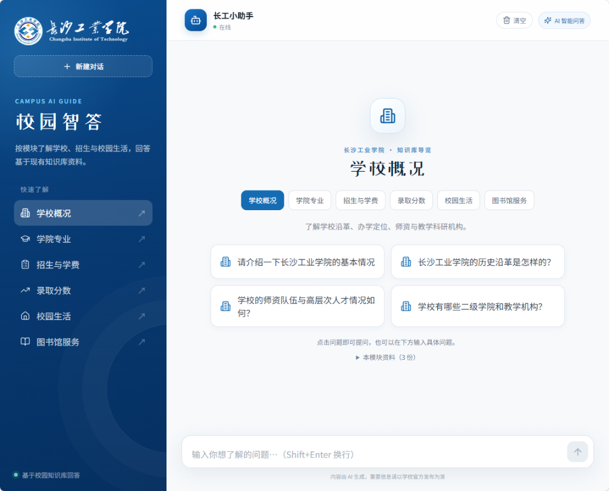

# School Guide · 校园智答 🎓

<p align="center">
  <strong>专为高校与组织场景打造的智能化知识库问答系统</strong><br>
  PostgreSQL 结构化精准查询 + 向量混合检索（Hybrid RAG）+ 智能意图路由 + SSE 流式极速响应
</p>

<p align="center">
  
  
  
  
  
  
</p>

<p align="center">
  <!-- 如有在线 Demo，可取消注释并填入链接： -->
  <!-- <a href="https://guide.tanzeng.xyz" target="_blank">🌐 在线体验 Demo</a> · -->
  <a href="#-快速开始">🚀 快速开始</a> ·
  <a href="#-系统架构">📐 系统架构</a> ·
  <a href="#-3-步迁移至你的学校机构">🔄 适配你的学校</a> ·
  <a href="#-生产部署">📦 生产部署</a>
</p>

---

## 📸 界面预览

<p align="center">
  
</p>

- **Bento 知识导航**：6 大分类（概况、专业、招生、录取分、生活、图书馆）与 24 个快捷推荐问题。
- **现代化流式对话**：打字机 SSE 响应、停止生成、重新回答、清晰溯源与来源高亮。
- **全端自适应**：深度适配桌面端与移动端浏览器。

---

## 🌟 核心特性与设计亮点

许多通用的 RAG 知识库系统在面对高校**录取分数线、招生计划等强数字敏感问题**时，极易产生“数字幻觉”或漏查。**School Guide** 采用针对性设计的双轨解决方案：

- 🎯 **双轨路由精准查询**：
  - **结构化精确查询**：历年投档分、招生计划、学费等数据结构化解析至 PostgreSQL，通过 SQL 100% 精确匹配，彻底消灭分数幻觉。
  - **混合检索（Hybrid RAG）**：开放性校园生活、学校历史、办事指南等采用 `pgvector` 向量语义召回 + PostgreSQL BM25 词法召回，并通过 **RRF (Reciprocal Rank Fusion)** 倒数排名融合后送入 **Rerank 重排序**，兼顾高召回与高精度。
- ⚡ **零 GPU 依赖 / 轻量化部署**：
  - 全链路基于云端兼容 API（支持 DeepSeek / 通义千问 / OpenAI / SiliconFlow / Ollama 等）。
  - 文档解析采用轻量化 **Microsoft MarkItDown** 引擎，内存开销极低，4G 内存轻量服务器即可顺畅运行。
- 🧠 **智能多轮对话改写**：自动结合最近上下文追问改写，判断用户真实意图后精准分流至结构化查询或 RAG 检索。
- 📂 **动态增量知识库更新**：支持在线上传新文档增量切分与向量入库，无需全量重建索引。

---

## 📐 系统架构

```text
                       ┌─────────────────────────┐
                       │        用户提问          │
                       └────────────┬────────────┘
                                    │
                                    ▼
                       ┌─────────────────────────┐
                       │   FastAPI / 意图路由器   │
                       └──────┬───────────┬──────┘
                              │           │
       【自包含招生/录取分数】  │           │  【校园生活/开放问答/追问】
                              ▼           ▼
        ┌─────────────────────────┐    ┌─────────────────────────┐
        │ PostgreSQL 结构化精确查询│    │   Hybrid RAG 混合检索   │
        │ (SQL 0幻觉匹配)         │    │  ├─ pgvector 向量检索   │
        └─────────────┬───────────┘    │  ├─ PG BM25 关键词检索  │
                      │                │  └─ RRF 融合 + Reranker │
                      │                └────────────┬────────────┘
                      │                             │
                      └──────────────┬──────────────┘
                                     ▼
                       ┌─────────────────────────┐
                       │  LLM 综合生成 + 来源引用 │
                       └─────────────┬───────────┘
                                     ▼
                       ┌─────────────────────────┐
                       │ SSE 流式输出至前端 Vue 3 │
                       └─────────────────────────┘
```

---

## 🛠️ 技术栈

| 领域 | 核心技术选型 | 说明 |
| :--- | :--- | :--- |
| **前端** | Vue 3 + TypeScript + Vite | 响应式 Bento 风格界面，Lucide 图标，Marked + DOMPurify 安全渲染 |
| **后端** | FastAPI + Pydantic + Uvicorn | 异步高性能 Web 服务，原生 SSE 流式传输 |
| **检索 / 数据库** | PostgreSQL 16 + pgvector | 统一承载向量特征、结构化招生表与 BM25 文本检索，省去多组件运维成本 |
| **缓存** | Redis | 结构化查询结果高效缓存（异常自动降级） |
| **文档处理** | Microsoft MarkItDown | 结构化清洗、重叠分块与元数据自动提取 |
| **模型协议** | OpenAI-Compatible API | 支持各类国内外大语言模型、嵌入模型与重排服务 |

---

## 🚀 快速开始

本项目支持 **Docker Compose 一键启动** 与 **本地源码调试** 两种方式。

### 方式一：Docker Compose 一键运行（推荐）

需已安装 Docker 与 Docker Compose：

```bash
# 1. 克隆代码
git clone https://github.com/yee211/school-guide.git
cd school-guide/deploy

# 2. 配置环境变量
cp .env.example .env
# 编辑 .env，填入你的 LLM_API_KEY、EMBEDDING_API_KEY、RERANKER_API_KEY 等配置

# 3. 启动全套服务（包含 FastAPI、PostgreSQL+pgvector、Redis）
docker compose up -d --build

# 4. 初始化预置数据（灌入示例知识库）
docker compose exec backend python -m scripts.build_index
docker compose exec backend python -m scripts.import_structured
```

访问 `http://localhost:8000/docs` 即可查看 API 文档。如需配套前端，请参考下述前端调试或 [完整部署指南](deploy/DEPLOY.md)。

---

### 方式二：本地源码开发

#### 环境要求
- Python 3.12+
- Node.js 18+
- PostgreSQL 16（需安装 `pgvector` 扩展；可使用 Docker 快速提供）

#### 1. 快速准备数据库（Docker 一行命令）
```bash
docker run -d --name school-pgvector \
  -e POSTGRES_PASSWORD=your_password \
  -e POSTGRES_DB=postgres \
  -p 5432:5432 \
  pgvector/pgvector:pg16
```

#### 2. 后端服务启动
```bash
# 创建并激活虚拟环境
python -m venv .venv

# Windows 激活：
.venv\Scripts\Activate.ps1
# Linux / macOS 激活：
# source .venv/bin/activate

pip install -r requirements.txt
cp backend/.env.example backend/.env
# 修改 backend/.env 中的数据库连接串与 API Key

# 初始化知识库数据
cd backend
python -m scripts.build_index
python -m scripts.import_structured

# 启动后端 API（监听端口 8000）
python -m uvicorn app.main:app --host 127.0.0.1 --port 8000 --reload
```

#### 3. 前端界面启动
```bash
cd frontend
npm install
npm run dev
```
打开浏览器访问 `http://localhost:5173` 即可开启交互。

---

## 🔄 3 步迁移至你的学校/机构

项目默认以**长沙工业学院**作为真实场景示例。你可以只需 3 步轻松改造为属于你自己学校或组织的专属知识库问答助手：

1. **替换知识库资料**：
   将你学校的招生简章、录取分数线表格、校园生活指南等文件（Markdown / TXT）放置于 `backend/data/raw/` 目录下。
2. **定制前端分类与快捷问题**：
   编辑 [`frontend/src/data/knowledgeModules.ts`](frontend/src/data/knowledgeModules.ts)，修改适合你学校的分类名称（如“校园地图”、“选课指南”）与 24 个快捷推荐问题。
3. **重建数据索引**：
   在后端目录执行 `python -m scripts.build_index` 与 `python -m scripts.import_structured`，完成新知识库的向量化与结构化导入！

---

## 📡 核心 API

| 协议 | 路径 | 描述 |
| :--- | :--- | :--- |
| `POST` | `/chat` | 标准阻塞式非流式对话问答 |
| `POST` | `/chat/stream` | **SSE 流式传输**问答，附带溯源元数据 |
| `POST` | `/knowledge/upload` | 上传新文档并自动触发清洗、切分与增量索引 |
| `GET` | `/docs` | Swagger 交互式接口调试页面 |

---

## 🧪 自动化测试与评测

项目内置了完整的单元测试与 RAG 检索评测脚本：

```bash
cd backend
python -m scripts.test_cleaner             # 文档清洗规则校验
python -m scripts.test_metadata_filters    # 元数据抽取与过滤测试
python -m scripts.test_structured          # 结构化 SQL 解析准确性校验
python -m scripts.evaluate_retrieval       # 检索指标评测 (Recall, MRR, NDCG)
```

---

## 📦 生产部署

生产环境推荐使用 **Nginx + Docker Compose** 架构部署，前端构建产物由 Nginx 托管，`/chat` 与 `/knowledge` 请求反代至后端容器并保持 SSE 长连接（`proxy_buffering off;`）。

详细部署手册与 Nginx 配置模板请参考：👉 [**完整生产部署指南 (deploy/DEPLOY.md)**](deploy/DEPLOY.md)。

---

## 📄 免责声明

> 本项目及其输出回答仅用于信息检索、技术展示与学术交流。招生政策、录取分数及学费等实际信息请以各高校官方招生网最新发布的正式公告为准。

## 🤝 贡献与反馈

欢迎提交 Pull Request 或创建 Issue！如果有任何改进建议、Bug 反馈或新功能想法，请随时参与贡献。

## 📜 许可证

本项目采用 [MIT License](LICENSE) 开源协议。
